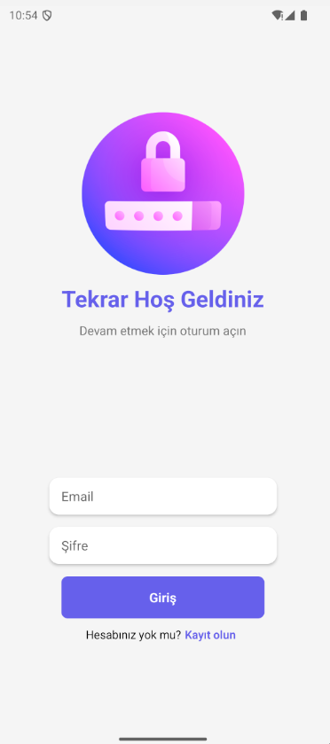
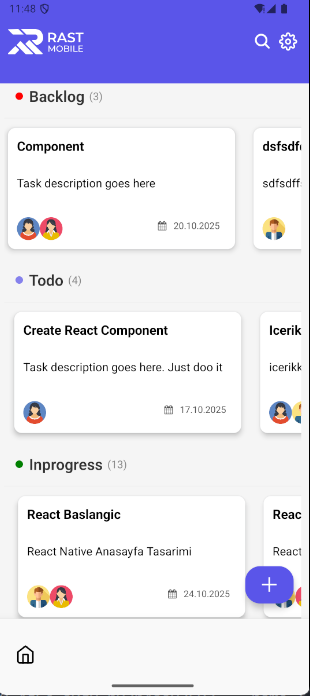
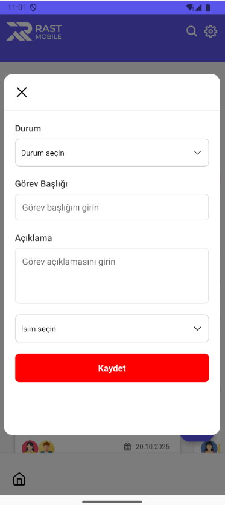
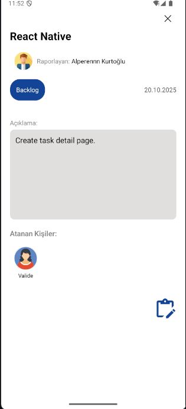
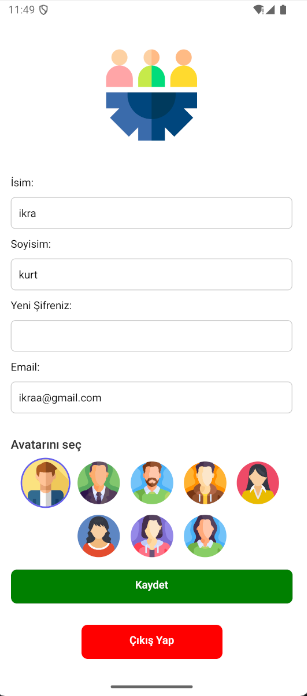

# Görev Yönetici Sistemi

**Görev Yönetici Sistemi**, kullanıcıların hesap oluşturup giriş yaptığı; görev ekleyip, düzenleyip, silebildiği, görevleri arayıp filtreleyebildiği mobil bir Kanban tarzı uygulamadır. Uygulamada kullanıcılar yalnızca kendilerinin eklediği görevleri düzenleyebilir — başka bir kullanıcı aynı görevi düzenlemeye çalışırsa uygulama uyarı verir.

---

## 🚀 Özellikler

* Kullanıcı kayıt (signup) ve giriş (login)
* Yetkilendirme: yalnızca görev sahibi düzenleme yapabilir
* Görev ekleme, düzenleme, silme
* Görevlerde arama & filtreleme
* Kullanıcı ayarları: profil bilgilerini güncelleme
* Görev detay sayfası (detay görüntüleme)
* Kullanıcı avatarları ve atama mantığı
* Mobil ön yüz: React Native + Expo (performans & taşınabilirlik)

---

## 💻 Teknolojiler

* **Frontend:** React Native, Expo, Expo Router
* **State management:** Redux Toolkit
* **Backend:** Node.js, Express.js
* **Veritabanı:** PostgreSQL (Knex veya doğrudan pg kullanılabilir)
* **Diğer:** Axios, express-validator, dotenv


---

## 🗄 Veritabanı (Basit Şema Örneği)

**users**

```sql
id SERIAL PRIMARY KEY,
name VARCHAR NOT NULL,
email VARCHAR UNIQUE NOT NULL,
password_hash VARCHAR NOT NULL,
avatar_index INTEGER,
created_at TIMESTAMP DEFAULT NOW(),
updated_at TIMESTAMP DEFAULT NOW()
```

**tasks**

```sql
id SERIAL PRIMARY KEY,
title VARCHAR NOT NULL,
description TEXT,
status VARCHAR NOT NULL, -- e.g. "todo", "in progress", "done"
assignees TEXT[], -- id'lerin string dizisi veya ayrı ilişki tablosu
created_by INTEGER REFERENCES users(id),
created_at TIMESTAMP DEFAULT NOW(),
updated_at TIMESTAMP DEFAULT NOW()
```

> Not: `assignees` ilişkisel model istersen ayrı bir `task_assignees(task_id, user_id)` tablosu kullan; bu, sorgular ve bütünlük için daha iyidir.

---

## 📌 API Endpointleri (Örnek)

### Auth

* `POST /user` — kayıt (body: name, surname, email, password, avatar)
* `POST /auth/login` — giriş (body: email, password)

### Tasks

* `GET /tasks` — tüm görevler (isteğe göre query ile filtreleme: ?status=todo&search=...)
* `GET /tasks/:id` — görev detay
* `POST /tasks` — yeni görev oluştur (gönderici token ile authenticate olur)
* `PATCH /tasks/:id` — görev güncelle (sadece görev sahibi ya da yetkili)
* `DELETE /tasks/:id` — görev sil

### Users

* `GET /users/:id` — kullanıcı bilgisi
* `POST /users` — kullanıcı kayıt sırasında kullanılır
* `POST /users/login` — kullanıcı giriş yapması sırasında kullanılır 
* `PATCH /users/:id` — kullanıcı profil güncelleme (kendisi için)

---

## 🔒 Yetkilendirme & Güvenlik

* JWT veya session tabanlı authentication kullanıldı.
* `express-validator` ile gelen body verilerini doğrula (title, email, link gibi).
* SQL Injection riski azaltmak için query builder (Knex) veya parametrized sorgular kullan.
* Güncelleme / silme işleminde, isteği yapan kullanıcının (token içinden alınan id) `created_by` ile eşleştiğini kontrol et.

---

## 📸 Ekran Görüntüleri








---

## ⚙️ Kurulum & Çalıştırma

### Gereksinimler

* Node.js (LTS önerilir)
* npm veya yarn
* PostgreSQL (veritabanı hesabı ve DB oluşturulmuş)
* Expo CLI (lokal CLI via `npx expo`)

### 1) Repository'i klonla

```bash
git clone https://github.com/kullanici_adi/gorev-yonetici-sistemi.git
cd gorev-yonetici-sistemi
```

### 2) Backend kurulumu ve çalıştırma

```bash
cd server
npm install
# .env dosyası oluştur (örnek .env.example dosyası ekle)
# .env içeriği örnek:
# API_URL:http://localhost:5000
# PORT:5000
# DB_HOST=localhost
# DB_TBL_NAME1=users    
# DB_TBL_NAME2=tasks
# DB_TBL_NAME3=task_assigness
# DB_USER=postgres
# DB_PASSWORD=secret
# DB_NAME=gorevdb
# JWT_SECRET=uzun-gizli-key
# JWT_EXPIRES_IN=1d

npm run migrate   # (opsiyonel: migration varsa)
npm run seed      # (opsiyonel: demo veriler)
npm start         # veya npm run dev (nodemon ile)
```

Backend `http://localhost:5000` üzerinde çalışacaktır (port .env'den ayarlanır).

> **Not (mobil cihaz erişimi):** Eğer mobil cihazla (Expo Go) test ediyorsan ve backend bilgisayarında localhost'ta çalışıyorsa, mobil cihaz `localhost`u göremez. Bilgisayarının yerel IP'sini `ipconfig`/`ifconfig` ile bul ve frontend `.env` veya `API_URL` olarak `http://192.168.x.x:5000` kullan.

### 3) Frontend (Expo) kurulumu ve çalıştırma

Projeye dön:

```bash
cd ../
npm install
npx expo start
```

* Geliştirme: `npx expo start` ve Expo Go uygulamasıyla QR okut.
* Eğer native build: `npx expo run:android` veya `npx expo run:ios`.

---

## 📁 Environment (.env) - Örnek

**server/.env**

```
PORT=5000
DB_HOST=localhost
DB_PORT=5432
DB_USER=postgres
DB_PASSWORD=secret
DB_NAME=gorevdb
JWT_SECRET=uzun-ve-gizli-key
```

**app/.env (frontend için)**

```
API_URL=http://192.168.1.25:5000   # bilgisayarının IP adresi ve backend portu
```


---

## ♻️ İyi Uygulamalar / Notlar

* Production için `.env` dosyalarını ve secret’ları GH’ye push etme.
* Veritabanı migrationlarını version control ile yönet.
* Kullanıcı yetkilerini backend tarafında kesinlikle doğrula.
* Expo splash ve asset cache sorunları için `npx expo prebuild --clean` kullan.

---

